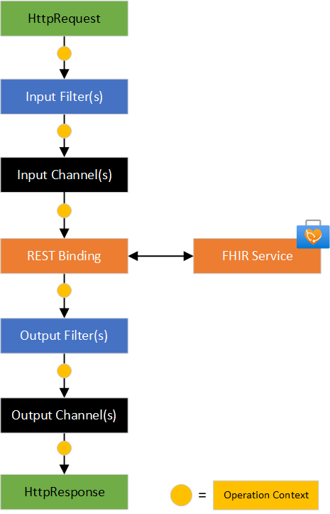
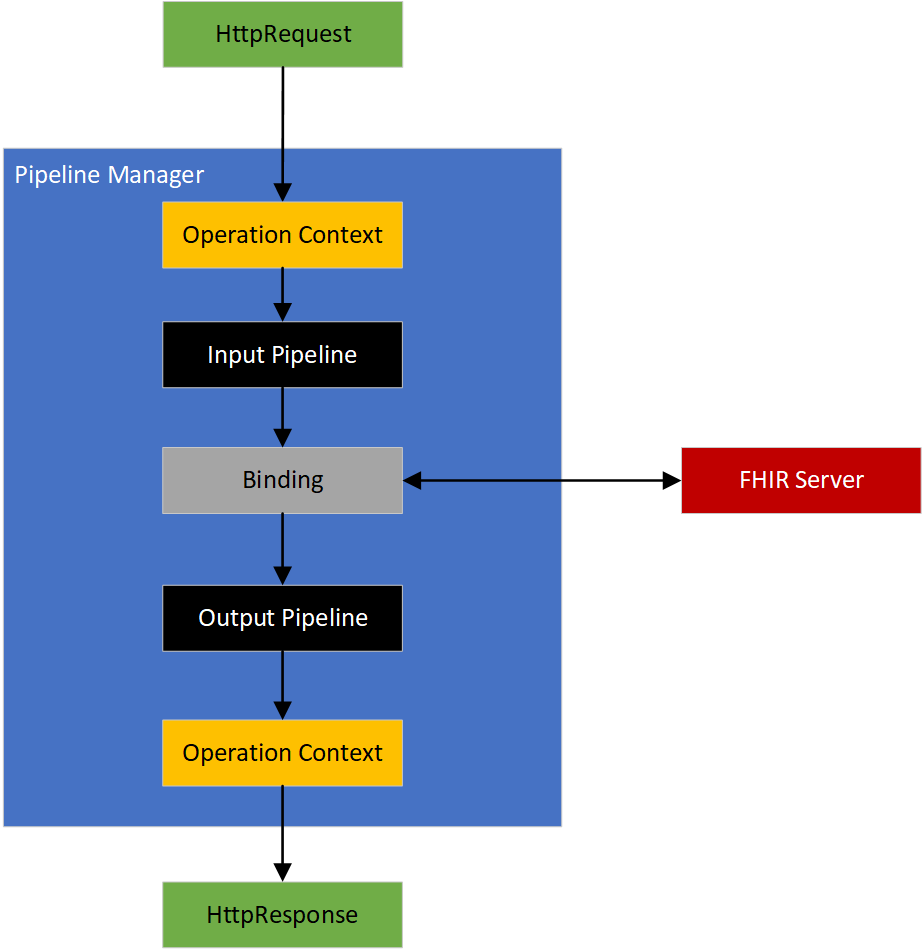
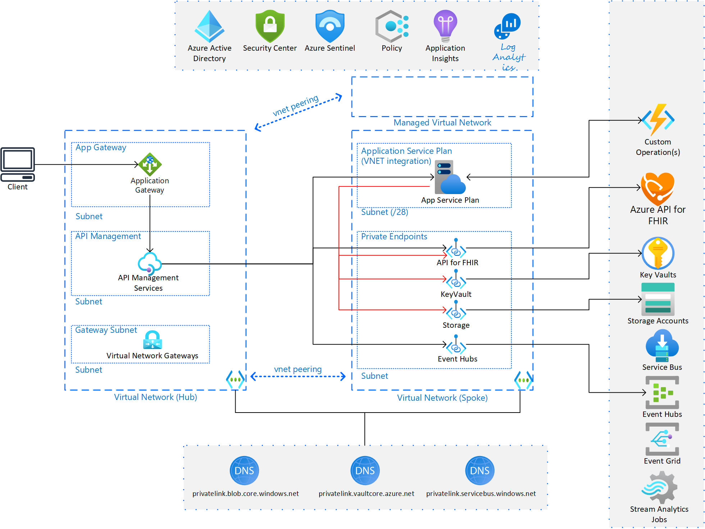

## Overview

The FHIR Proxy SDK is intended to be used to build solutions with Azure Healthcare APIs where FHIR requests and/or responses need to be intercepted in transit.  The SDK provides the building blocks for these *custom operations* as well as integration with other services.  We have also provided a prescriptive architecture for deployment Azure Healthcare APIs and integration with other services, such that you can reliably create secure and scalable solutions.  You can find documentation of the API [here](./doc/reference/toc.html), and sample code [here](https://github.com/microsoft/fhir-proxy-samples).

## NuGet Packages
- [Microsoft.Health.Fhir.Proxy](https://www.nuget.org/packages/Microsoft.Health.Fhir.Proxy.Core/)
- [Microsoft.Health.Fhir.Proxy.Extensions.Channels](https://www.nuget.org/packages/Microsoft.Health.Fhir.Proxy.Extensions.Channels/)
- [Microsoft.Health.Fhir.Proxy.Storage](https://www.nuget.org/packages/Microsoft.Health.Fhir.Proxy.Storage/)
- [Microsoft.Health.Fhir.Proxy.Caching](https://www.nuget.org/packages/Microsoft.Health.Fhir.Proxy.Caching/)

## Pipelines

Pipelines are used to build the *custom operation* and can be used to (i) modify information, (ii) acquire additional information to make decisions, and (iii) output information to our services.  The first two are performed through a chain of 0 or more *filters* where each filter in the chain performs some operation.  The latter is performed through *channels*, which simply output information 0 or more desired services. Input and output pipelines are connected through a binding, which either (i) call the FHIR server and returns the response to the output pipeline (RestBinding), or (ii) is omitted and directly calls the output pipeline if present or returns the result of the input pipleine.

## Pipeline

## Pipeline Management

 
## Infrastructure Architecture
The infrastructure makes use of Azure Application Gatway, Azure API Management (APIM), a private Virtual Network, and private endpoints.  We use APIM to route specific request to *custom operations* and all others route directly to the FHIR server.

## Contributing

This project welcomes contributions and suggestions.  Most contributions require you to agree to a
Contributor License Agreement (CLA) declaring that you have the right to, and actually do, grant us
the rights to use your contribution. For details, visit https://cla.opensource.microsoft.com.

When you submit a pull request, a CLA bot will automatically determine whether you need to provide
a CLA and decorate the PR appropriately (e.g., status check, comment). Simply follow the instructions
provided by the bot. You will only need to do this once across all repos using our CLA.

This project has adopted the [Microsoft Open Source Code of Conduct](https://opensource.microsoft.com/codeofconduct/).
For more information see the [Code of Conduct FAQ](https://opensource.microsoft.com/codeofconduct/faq/) or
contact [opencode@microsoft.com](mailto:opencode@microsoft.com) with any additional questions or comments.

## Trademarks

This project may contain trademarks or logos for projects, products, or services. Authorized use of Microsoft 
trademarks or logos is subject to and must follow 
[Microsoft's Trademark & Brand Guidelines](https://www.microsoft.com/en-us/legal/intellectualproperty/trademarks/usage/general).
Use of Microsoft trademarks or logos in modified versions of this project must not cause confusion or imply Microsoft sponsorship.
Any use of third-party trademarks or logos are subject to those third-party's policies.

